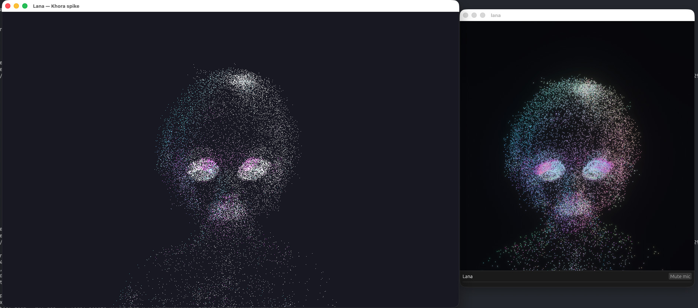

# lana-khora



A throwaway **spike**: Lana's point-cloud avatar, rendered on
[KhoraEngine](https://github.com/eraflo/KhoraEngine) instead of Bevy, as a standalone app —
built to de-risk a possible Bevy → Khora move **before** investing weeks.

It loads a model (`.glb`/`.vrm`/`.pcd`), samples its vertices+normals,
and draws them as a glowing `PointList` cloud through a hand-written WGSL
pipeline — a faithful port of `lana-avatar`'s `point.wgsl` (flow drift,
jitter, dissolve, back-cull, two-ring eyes auto-centred on the detected
eye cluster, scan sweep, mouth-cluster lip-sync, breath, hue drift) with
the **exact** same normalization and orbit camera.

**Constraint honoured:** zero edits to KhoraEngine. Everything below is
reached through the public `khora-sdk` only.

## Run

```sh
cd lana-khora
LANA_KHORA_MODEL=/path/to/model.glb cargo run
# else it picks the first .glb/.vrm/.pcd in the CWD, or a procedural sphere
```

Camera: left-drag to orbit (no auto-spin). Keep the window frontmost
(an occluded surface can't be acquired — see findings). Pose pinned via
the same `LANA_AVATAR_CAM_DIST` / `LANA_AVATAR_CAM_Y` env vars as
`lana-avatar`, so a pose tuned there transfers verbatim.

## Verdict

**Feasible.** The full custom-render path works from an external app with
no engine fork: `GraphicsDevice` → custom WGSL `PointList` pipeline +
buffers → swapchain `ColorTarget` → draw → present.

### The integration seam (non-obvious — document for any future work)

- `khora_core::control::gorna::AgentId` is a **closed enum**
  (`Renderer, ShadowRenderer, Physics, Ecs, Ui, Audio, Asset` — no
  `Custom`), and `Agent::id() -> AgentId` is mandatory. So an external
  app **cannot** register a custom render `Agent`.
- Working approach: implement `khora_core::lane::Lane` and drive it from
  `EngineApp::after_agents`, recording into a command encoder and
  submitting **directly** via `GraphicsDevice::submit_command_buffer` —
  **not** the frame graph (see ordering finding below).

## Findings

### 1. Bug — `BufferUsage` VERTEX/INDEX bit swap (one-line fix)

`khora-infra/src/graphics/wgpu/device.rs` `WgpuDevice::create_buffer`
maps usage with:

```rust
usage: wgpu::BufferUsages::from_bits_truncate(descriptor.usage.bits())
```

a raw bit copy. But the bit layouts differ:

| flag  | Khora `BufferUsage` | `wgpu::BufferUsages` |
|-------|---------------------|----------------------|
| VERTEX | `1 << 4`            | `1 << 5`             |
| INDEX  | `1 << 5`            | `1 << 4`             |

(STORAGE / INDIRECT / QUERY_RESOLVE also diverge.) A `VERTEX` buffer
silently becomes an `INDEX` buffer → wgpu rejects `set_vertex_buffer`
with `MissingBufferUsage`.

The correct, field-by-field conversion **already exists** —
`IntoWgpu<wgpu::BufferUsages> for BufferUsage` at
`khora-infra/src/graphics/wgpu/conversions.rs:402`, used everywhere else
(e.g. `create_render_pipeline`). **Fix:** `create_buffer` should use
`descriptor.usage.into_wgpu()`. This is the exact bug class the author
already fixed for textures (see the comment at `device.rs:46`) — just
missed on the buffer path.

*Spike workaround (no engine edit):* request `VERTEX | INDEX | COPY_DST`
so the raw copy yields wgpu `INDEX | VERTEX | COPY_DST` — `VERTEX` is
present either way. Remove the `INDEX` bit once `create_buffer` is fixed.

### 2. Frame-graph ordering vs. external passes

`khora-data/src/render/frame_graph.rs::sorted_passes` adds a dependency
edge only *writer → reader*, tie-broken by **insertion order**. The
winit loop runs `before_agents → run_scheduler (RenderAgent adds its
ScenePass) → submit_passes → after_agents → present_frame`. A pass added
in `before_agents` is inserted *before* RenderAgent's ScenePass; with no
camera that ScenePass is a **clear-only** pass (`writes(Color)`, no
draws), so it runs after ours and wipes the swapchain. Net: black screen.

This is why the engine's own `UiAgent` works (it's a scheduled agent
inserted *after* ScenePass) and an external `before_agents` injection
does not. The spike sidesteps it entirely by injecting from
`after_agents` and submitting the command buffer directly to the device
queue, bypassing the frame graph.

### 3. Capability gap — no HDR / bloom (the real long pole)

KhoraEngine has **no HDR offscreen target, bright-pass, blur, bloom
composite, or tonemapping** anywhere (only an inline "simple tone
mapping" in one forward shader). Lana's entire visual identity is HDR
emissive → camera bloom — two lines in Bevy (`Bloom::NATURAL` +
`Tonemapping`). In Khora it must be built from scratch. The spike's glow
therefore **clips** instead of blooming; this is the only intentional
visual difference from `lana-avatar`. **This, not any bug, is what makes
a real migration a multi-week effort.**

### 4. Benign noise

`khora_sdk::engine` logs an `ERROR` every frame the window isn't
frontmost (`begin_frame failed: ... Occluded`). Harmless surface-acquire
skip; the spike silences that module.

## Proposed improvements (for KhoraEngine)

1. **`create_buffer`: use `descriptor.usage.into_wgpu()`** instead of
   `from_bits_truncate(.bits())`. One line; fixes silent buffer-usage
   corruption for any custom pipeline. (Audit other `from_bits_truncate`
   on cross-crate flag enums while at it.)
2. **App-extensible rendering.** Either an `AgentId::Custom(...)` /
   string variant, or a sanctioned `EngineApp`/SDK hook to register a
   custom render lane/pass that composites *after* the scene — so apps
   don't have to bypass the frame graph via direct submission.
3. **Bloom / HDR post-process lane.** Required for any glow-based
   aesthetic; the single biggest gap for adopting Khora here.
4. **Lower the `Occluded` log from `ERROR` to `DEBUG`/`TRACE`** — it is
   normal window behaviour, not an error.
5. **Expose window size/aspect to `before_agents`/`after_agents`.** The
   spike gets the live size from `before_frame`'s `&dyn KhoraWindow`
   (`inner_size()`) and caches the aspect, so resizing rescales correctly
   — but the render hooks (`before_agents`/`after_agents`) get no window
   and `FrameContext` carries no dimensions, so any per-frame render code
   needs that side channel. Putting the surface extent in `FrameContext`
   would remove the dance.

## License

Dual-licensed under either of

- Apache License, Version 2.0 ([LICENSE-APACHE](LICENSE-APACHE))
- MIT license ([LICENSE-MIT](LICENSE-MIT))

at your option — same as Lana itself. KhoraEngine is consumed only as a
Cargo git dependency (not redistributed here); its Apache-2.0 terms apply
to the engine, not to this code.
